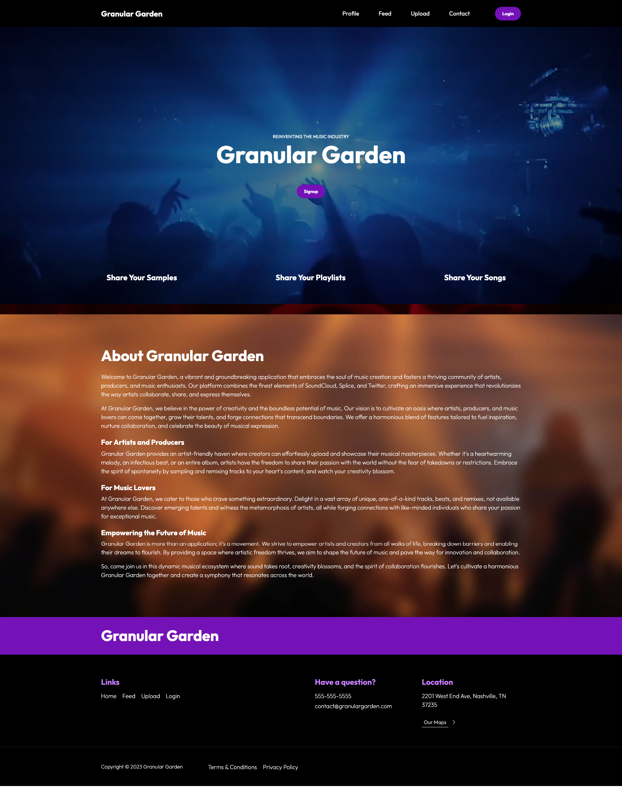
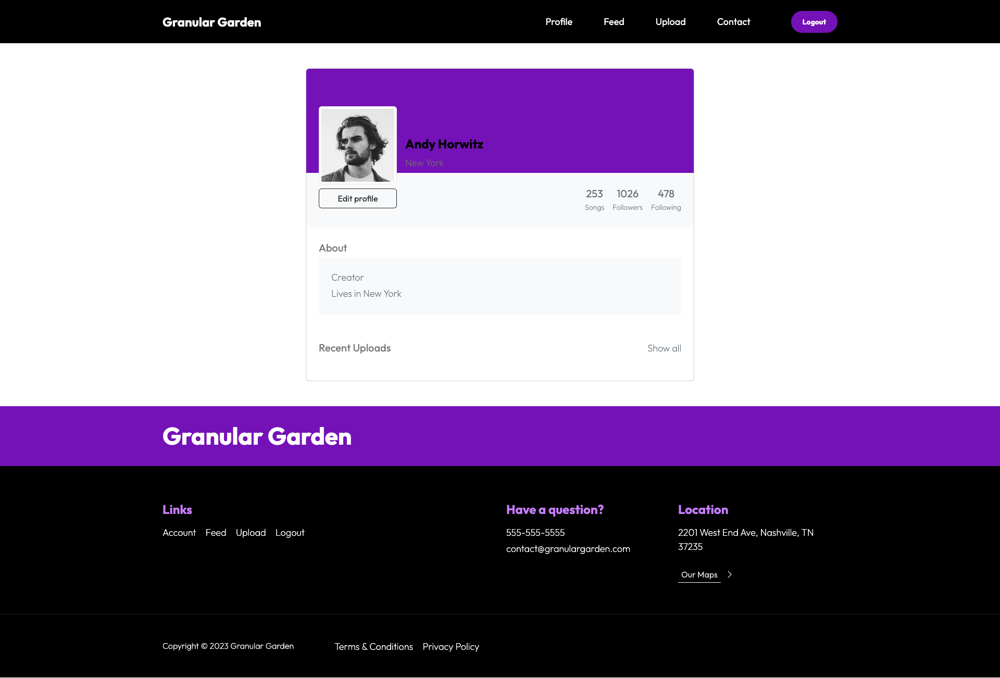
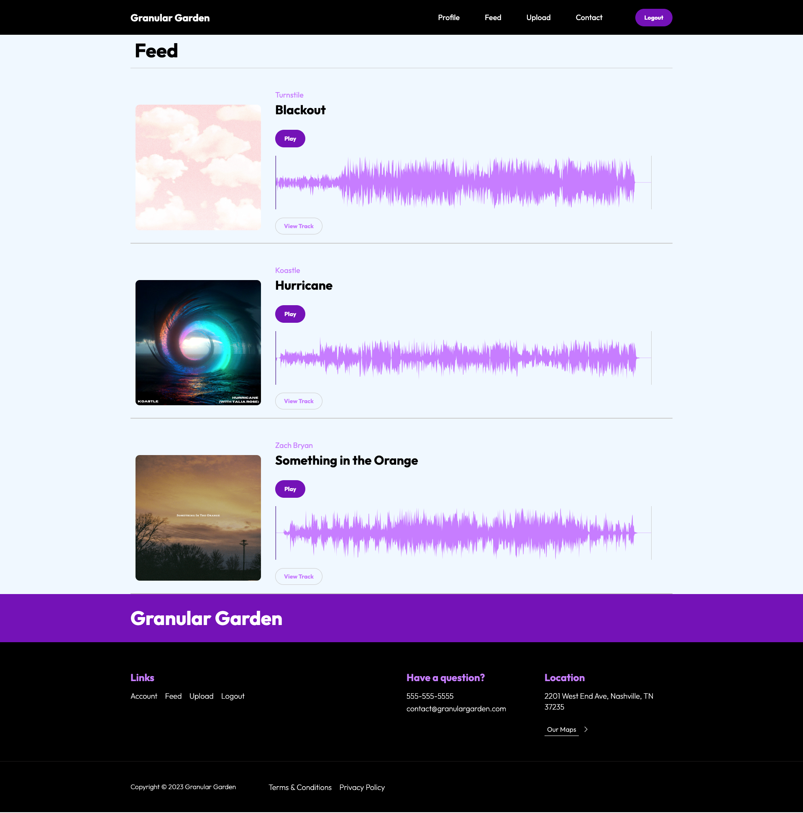
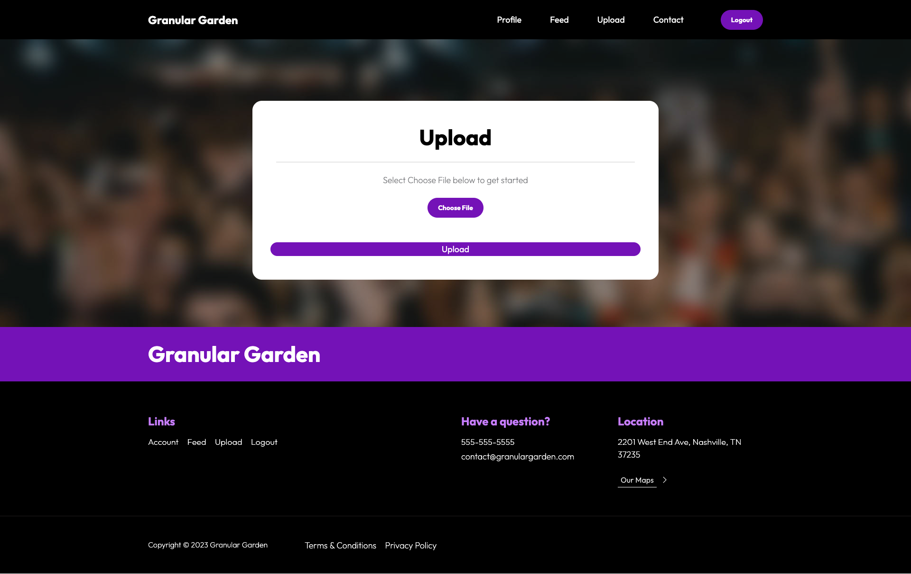

# Granular Garden

## Description
Granular Garden is a web application that provides creators, artists, and producers the ability to upload tracks to a public feed so that others artists can listen and interact. Artists can create their own accounts, upload their own tracks, and play right from the feed. They also have the ability to comment on other user uploads. Artists can also develop their own profile and update it their information. 

## Usage
When you first visit the site, you're presented with a homepage that describes what Granular Garden is for. If you don't have an account, you'll want to select the sign-up button and create an account. You'll then be prompted to create a username, enter your email, and setup a password. From there, you'll have the ability to visit your profile page, view the public feed and play tracks, and upload your own tracks. To upload tracks, you select Choose File from the Upload page, and select a file from your computer. After you upload, your track will appear in the Feed page. If you're wanting to comment on another track, simply view the track on the Feed page and add your comment. 

## Features
- Personal account
- Upload own .mp3 tracks
- Comment on other tracks in public feed
- Play tracks

## Credits

The following developers were involved on this project: 

- Zoe Edge: https://github.com/zoeedge16
- Brady Billeisen: https://github.com/brady-billeisen
- Joshua Williams: https://github.com/codehashira28
- Cameron Singleton: https://github.com/culinarycam
- Cameron French: https://github.com/cameronfrench

  
  
